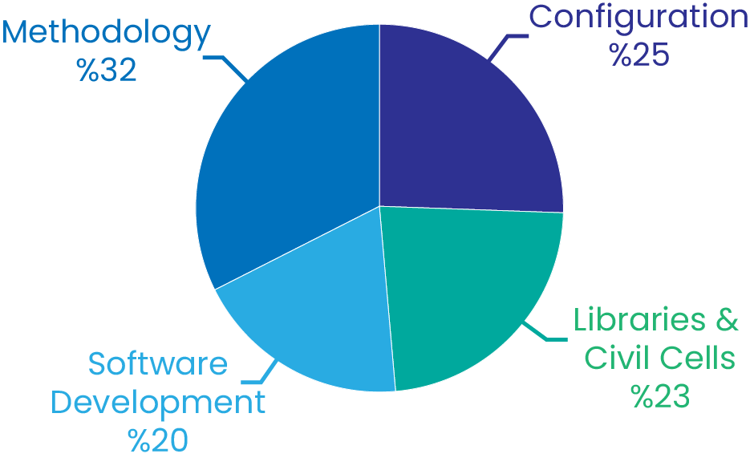
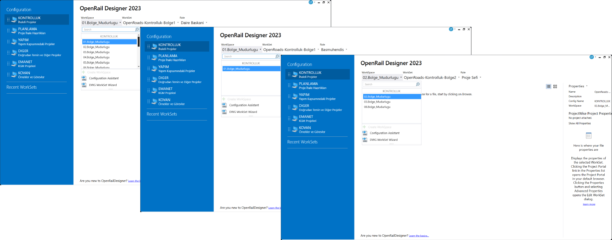
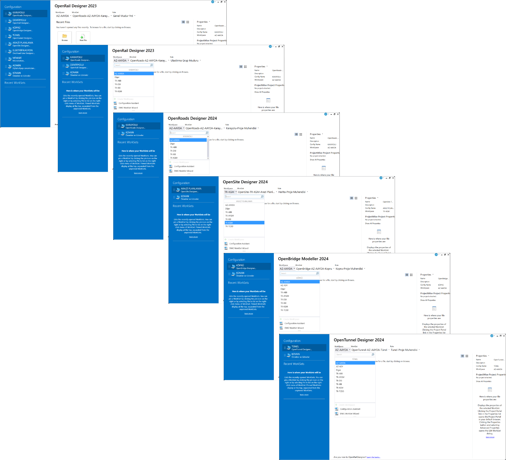
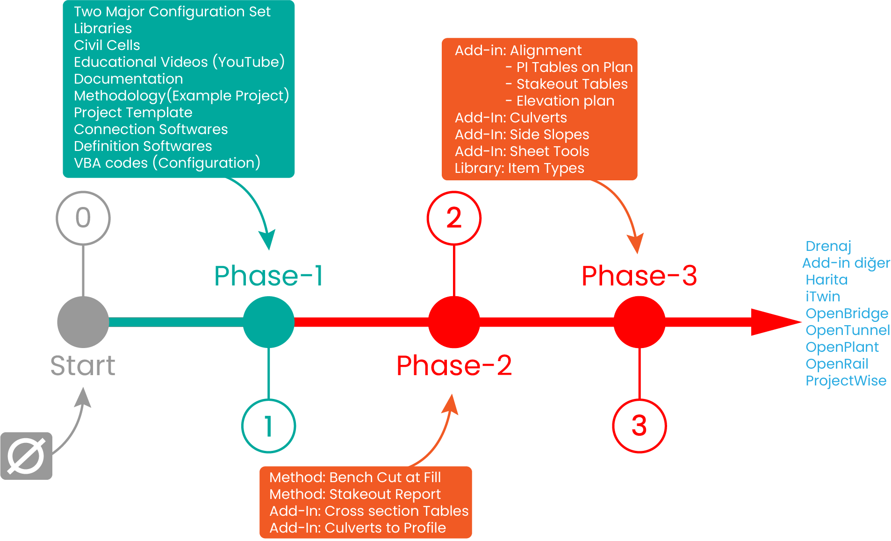

# My Productions for Bentley Systems Turkey Distributor

## Headlines

Between June 2023 and February 2025, I developed the tools, settings, and configurations necessary for the utilization of Bentley Systems' Connect Series programs while working with Bentley Systems' Turkey distributor. Although my work predominantly focused on road-related **Libraries** & **Civil Cells** due to my background in highway design, I also carried out extensive work in the area of **Configuration**.

When I began working with the distributor in June 2023, there were no prior efforts in Turkey in this area. Starting with an empty folder, I devoted significant time and effort to build these solutions.

To provide insight into the scope of this process, the progress made, and the requirements for transitioning to new technologies, I have outlined the main topics of my work along with the percentage distribution of time I dedicated to each. This can be reviewed in the chart below.

My work was not just a software change for design but also a process that involved resource management within the **BIM** framework, requiring a fundamentally different approach. Throughout all phases, my progress followed a "trial-and-error" methodology, as it was nearly impossible to find documentation on the subject beyond the program's Help files.

    

## Libraries and Civil Cells

<head>
  <link rel="stylesheet" href="https://cdnjs.cloudflare.com/ajax/libs/font-awesome/5.15.4/css/all.min.css">
</head>

  
<b>Learn About Libraries<i class="fas fa-arrow-right"></i></b>

> Libraries Required for Design Implementation:
>
> **Definition Libraries** Unlike Inroads, in the Connect Series, you need to define what you are creating in advance for the program. (Think of it as being unable to create an alignment in Inroads without assigning a style.) The visual characteristics of your alignment, such as how it looks, and some of its automatic capabilities are derived from feature definitions. There are four basic definitions from top to bottom:
> 	- Feature Definition (Top level definition. i.e "Alignment")
> 	- Feature Symbology  (Similar to symbology in InRoads
> 	- Element Template (A more organized and enhanced version of Levels.)
> 	- Level (Same as select series)
> Definition libraries store these specifications, and when you create an element, it derives its displayed properties from these libraries.
>
> **Template Library** It can be described as a slightly more advanced version of InRoads' ITL library.
>
> **Superelevation Calculation Library** It is in XML format and has a formulation structure similar to the MDL programming language. It is a structure where almost every mathematical formula can be entered, and loops can be achieved through indirect methods. With every route change, the program refers back to this file and recalculates according to the given parameters.
>
> **Design Standart Libraries** It ensures the control of many parameters, such as minimum spiral length, minimum horizontal curve length, and the required "K" coefficient for vertical curves.
> 
> **Display Style Libraries** Since the entire design is carried out with elements "drawn" on the screen, a complex working environment can emerge. These libraries allow focusing on the correct design elements when needed and increase efficiency.
> 
> **Menu Libraries** It saves designers from searching for commands in the "Ribbon" during the design process. By assigning keyboard shortcuts to workgroups, commands can be accessed by pressing just one or two keys.
> 
> **Sheet Libraries** The required sheet formats are stored in these files. Later, during the sheet creation process, the frames (named boundary) read the sheet formats from these files.
> 
> **Annotation Libraries** Section, plan, and profile information are also stored in a library file within structures called "Annotation Groups." When you issue the command to print information to the program, it refers to these files.
> 
> **Civil Cell** An engineering solution can be encapsulated as a Civil Cell. Just as a title "cell" file can be used in every drawing, a "ramp" Civil Cell can repeat your procedure for every newly created junction. Without Civil Cells, it is not possible to fully utilize the design power of the program.
>

I have created the main libraries required for the program to work, in "Turkish," taking into account the Turkish and AASHTO standards:

 - Definition Libraries
 - Template Libraries
 - Superelevation Calculation Library
 - Design Standart Libraries
 - Display Style Libraries
 - Menu Libraries
 - Sheet Libraries
 - Annotation Libraries
 - Civil Cell Libraries

## Configuration

<head>
  <link rel="stylesheet" href="https://cdnjs.cloudflare.com/ajax/libs/font-awesome/5.15.4/css/all.min.css">
</head>

  
<b>Learn About Configuration<i class="fas fa-arrow-right"></i></b>

> All Connect series programs are Network programs. If your programs are not reading the necessary settings and libraries from a network, your situation can be summarized as follows: You bought a new phone but you don’t have a SIM card. To use your phone and access your settings and photos from Google or Apple servers, you will need to purchase a SIM card as well.
If you cannot deliver your libraries and settings to users from a single source, InRoads may give better results in many ways. However, it is certain that continuing with InRoads will not provide good results in the future.
>
> The libraries prepared for the Connect Series programs are not copied to users' computers for use. The libraries are transmitted to each user through a "read-only" sharing mechanism. The programs can read the contents of the libraries, but users cannot modify the libraries.
>
> Think about it this way: In InRoads, you start each project by copying various files (e.g., itl, xin, etc.). How many itl or xin files do you have on your computer and various hard drives/flash drives? Now, add all your colleagues who work at your company to the mix—what is the total number? In the Connect Series, when the program runs, one pre-configured template library is delivered as a "read-only" library to all users. Similarly, all layers, drawing settings, and calculation files are automatically delivered to users from a single source. There is only one instance of each library. Users cannot modify these libraries but can use them.
>
> Additionally, the program's required configuration files must also be delivered to the user as "read-only" because if you copy hundreds of configuration files to each user's computer, you will create a structure that cannot be revised or managed effectively.
>
> Configuration systems serve this exact purpose — to deliver all settings and libraries to the users. So, how is this organization structured? When there is a need to change a library or a setting, how and by whom will this change be made? Connect Series programs require a team of several responsible individuals working in the background to monitor and manage the system. These responsible individuals handle necessary plugins, add or remove users, continuously configure the system to meet the needs of the organization, and modify it according to requirements over time. Connect Series programs do not have a structure like Inroads, where personal archives take center stage. If an add-in is produced or an enhancement is made to the itl library, the work is done at the source point and for everyone.

I created two main configuration systems within the distributor company, named **Authorizer** and **Contractor**. I integrated the necessary settings and libraries for the program to work with these two configuration systems. These two systems operate on a mechanism hosted on Google Drive. They are modifiable and can be interconnected. Both configuration systems benefit from the sources I created (libraries and settings). I also created slots within the configuration systems where the organization’s own resources can be stored. For example, a company’s titleblock cell, if placed in the appropriate folder, can be available to all project producers in the company.

Below, you can see the configuration system I prepared for the Authorizer. Since I come from a road-project background and my content preparation is also in this direction, I preferred to create an example system for KGM (General Directorate of Highways). Of course, this system is role-based and structured in a way that the Administration can also produce projects if they wish.

    

The configuration is not limited to OpenRoads/OpenRail Designer. **The systems I have created are designed to be compatible with all Bentley Systems programs**. For example, an architectural team using Microstation, a bridge group using OpenBridge, etc., can all access the same title blocks, layers, and calculation files from the same source. BIM is not only related to the digital approval of your projects. The configuration systems I have designed, although not specifically related to project management, are structured in a way that supports the Single Source of Truth, which is one of the most important requirements of BIM, in the context of resource management, improving users' workflows. This is precisely how it should be.

Below, you can see the configuration system I created for **Contractor**. As you can see, it is possible to integrate project teams using different Connect Series programs into a unified system.

    

The Role concept present within the Connect Series programs has also been integrated into the systems in various ways. Each user accesses the program with a role assigned to them. While I haven’t yet assigned major responsibilities to roles, I have brought the concept to the surface within the configurations so that it can be used for various purposes in the future. For example, when a designer opens the program, they can access design add-ins, while a technician working with drawings will be able to access drawing-related add-ins.

## Methodology

  
<b>Learn About Methodology<i class="fas fa-arrow-right"></i></b>

> If all you have are the points mentioned above and you are not familiar with the methods of the program, it will not be possible to produce a project. Bentley Systems offers users free courses under the "Learn" category, covering almost every topic. If you consider them individually, the courses can be considered quite successful. However, to create an entire project, you need to bring together multiple variables, use dozens of methods, and have a structured approach. For example, in a design program where almost every design unit is presented as a graphic and can be transferred between files through referencing, **File Management** becomes critically important. Additionally, it’s not easy to find a pre-made answer for how to **manage a long and complex road model on an average computer**.
> 
> The current examples only showcase a 3D design output, which presents a view we are not very accustomed to. While working on my methodology studies, I designed civil cells that connect both the 3D model and the 2D model. This allowed me to recreate the project appearance we've been producing for years in Turkey and surrounding countries. I tried to adapt the design methods I’ve used for years in InRoads into civil cells, aligning those methods with the new technology.

I created a [YouTube](https://www.youtube.com/@Kovan-Connect) channel and worked on a project involving two intersections, using the civil cells I developed. The process was very helpful, and over time, a series of 24 videos was created, which is relatively rare on YouTube. On this channel, I not only focused on project production but also addressed the issues I encountered during the process and their solutions.

Creating a video for YouTube is a very labor-intensive task. It was not possible for me to prepare the entire methodology I have developed during my time at the Distributor for YouTube. However, I documented topics such as earthworks, cross-section drawings, and the creation of plan-profile sheets, and included these documents in the project I prepared as examples.

**Topics I’ve solved regarding Methodology**:

- **Design**
  - Creation and management of **mainline models** with civil cells
  - Creation of **intersection axes** with civil cells
  - Execution of the **elevation transfer procedure** in interchanges using civil cells
  - Creation of stone **retaining walls** with civil cells
  - Design of the **intersection model** commonly used in Turkey with a single civil cell
  - Design of **intersection islands** using civil cells
  - Modeling of a two-span **underpass** with civil cells
  - Creation of a **Project Template** as a result of the work (each project starts by copying from this template)

- **Drawings**
  - Preparation of **cross-section sheets** (A0 and Rolled A0)
  - Creation of **Plan and Profile-Roll** sheets
  - Creation of **A1-plan&profile** sheets in KGM format
  - Creation of **A1-plan&profile** sheets in **construction format** (global)
  - **Automatic numbering** of sheets using **Sheet Index**
  - **Automatic naming** of sheets using cells and text fields

- **Reporting**
  - Automatic transfer of **earthworks volumes** xml reports to Excel using Power Query

## Softwares

### ORD Indexer

In 2023, I realized that making the necessary definitions (f. definition, f. symbology, element template, levels) for the program in a DGN file is a very time-consuming task.
Additionally, if you create the definitions one by one, it becomes difficult to plan your overall schema properly, and creating a clear folder structure becomes nearly impossible.
From this realization, I developed ORD Indexer, which creates definition libraries interactively with Excel.

You set up your schema in Excel, and enter the definition entries into the ORD Indexer interface. ORD Indexer then provides you with three XML files and one CSV file. These files can be imported into OpenRoads/OpenRail. I used this software to create the majority of the definition libraries for the Distributor company.

  <iframe
    src="https://www.youtube.com/embed/UQRc8n_g_OE"
    frameborder="0"
    allowfullscreen
    style="position: absolute; top: 0; left: 0; width: 100%; height: 100%;"
  ></iframe>

### Connector

To ensure users can access the system on the USER side:

- Connects Connect Series programs to the system I installed
- Contains a video viewing mechanism
- Contains a document reading mechanism
- Provides announcements and member lists to users

<video controls style="width: 100%; height: auto;">
  <source src="../_static/connector.mp4" type="video/mp4">
  Your browser does not support the video tag.
</video>

### Admin Panel

To manage the system on the ADMIN side:

- A software that automates the sharing with users using the appropriate APIs
- Automatically generates the configuration files that need to be produced for each user

*Since it is a management program, I am not sharing a user interface screenshot here*

## Results

  
<b>Learn about the topics that can be achieved with Add-ins only<i class="fas fa-arrow-right"></i></b>

> No ready-made solutions available in OpenRoads/OpenRail Designer for the followings:
> 
> - Side slopes (existing solution in the softwares not suitable for the needs in our region)
>
> - Drawing horizontal axis information and preparing route tables
>
> - Creating and placing cross-section tables
>
> - Placement of culverts based on "cross-section" is not possible; a culvert layout in the traditional form can only be achieved through custom software solutions.
>
> - "Superelevation calculation" that does not require editing is not possible; for curves with lower speeds than the project (restricted speeds), editing is inevitable in the range where the transition length for superelevation is applied.
>
> - Insufficient automation for processing sheet details
>
> - Elevation-based plan generation
>
> These issues can only be addressed by developing add-ins.
>

Here is my transition plan for the entire process:

    

**Phase-1** represents the point I reached during my time working with the Distributor company. Phase-1 is a ready-to-activate system that contains essential libraries, an example project, and a project template, offering the resource management mechanism of BIM that anyone can connect to. All future developments can be integrated into this system. Designers can experience and enhance an example project.

Once **Phase-2** is reached, it will be possible to produce a project with the program. This phase can be called the Hybrid Period because topics like Slope Scanning, PI and axis information, and culvert plan layout and culvert sections will need to be completed using InRoads and Select Series VBA codes. The Connect Series alignments and terrains can be easily imported into InRoads. The project production can continue by benefiting from this exchange between Phase-2 and Phase-3.

When **Phase-3** is reached, project production will be possible without the need for InRoads and old technology, and the transition will be complete.

## Final Thoughts

Bentley Systems created the Connect Series with the goal of providing a mechanism where all settings and requirements are offered to users from a shared pool in the background, allowing users to focus solely on their projects. However, it does not provide a ready-made system, settings, and libraries for everyone; it only offers basic examples during the program installation. Although Connect Series programs have been sold in our country for years, due to the lack of a dedicated expert team, neither the authorities nor project firm managers have been informed about the fundamental requirements. Designers, having not been able to test the programs in a system with the correct settings, are unaware of the full potential of what can be done with the programs. The transition process to the Connect Series worldwide, on the other hand, has matured over the years through the efforts of specialized teams working in the background.

During my time working at the Distributor company, I combined my professional experience, software development knowledge, and the core purpose of the Connect Series programs to establish a system that could be activated, reaching the stage I named "Phase-1." Since there was no existing example, I did not base my work on any previous studies but rather created the example.

I am not aware of how the Distributor company will use the work I have done for the company or how they will operate the system. One thing to remember is that Connect Series programs are as powerful as the experts working behind the scenes to keep the system alive, troubleshoot, and make updates. 

