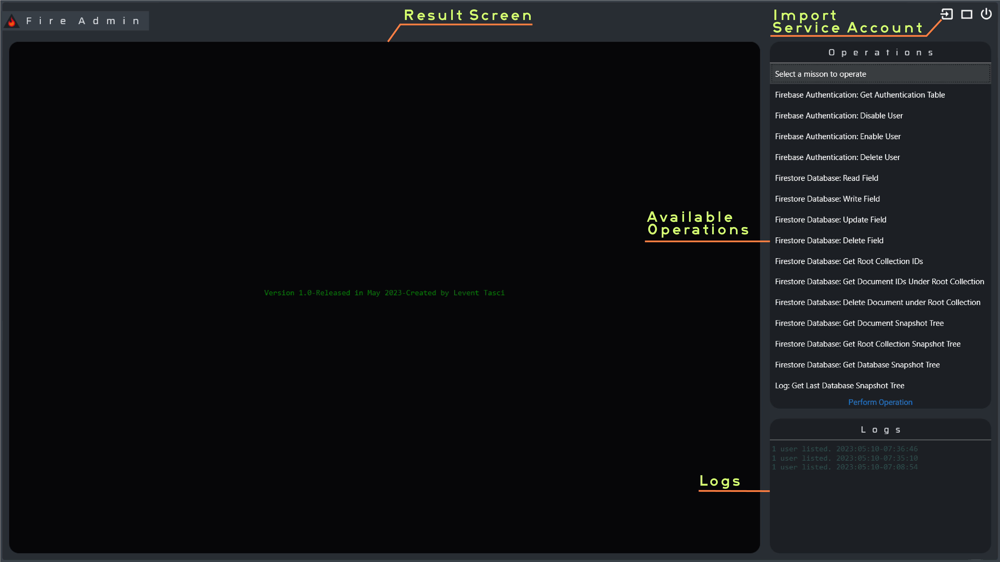

# FireAdmin

This project is a C# application that allows users to access Firebase and Firestore Database using the FirebaseAdmin SDK. The project aims to provide easy access to those who use Firebase for user authentication and authorization in their applications.

    

You can review the details of this open-source project on [github](https://github.com/leventtasci/FireAdmin/tree/master/FireAdmin)

