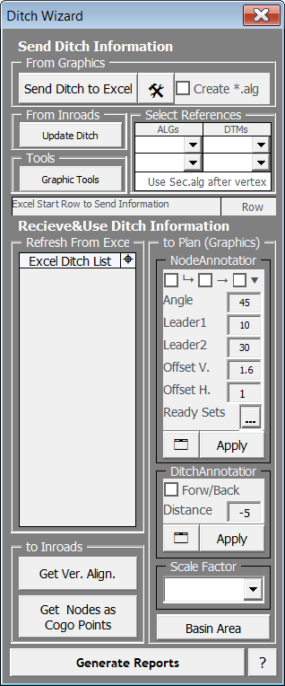

# **Ditch Wizard**

  <iframe
    src="https://www.youtube.com/embed/FiD_0VXeGL0"
    frameborder="0"
    allowfullscreen
    style="position: absolute; top: 0; left: 0; width: 100%; height: 100%;"
  ></iframe>

  { style="float: left; margin-right: 20px; margin-top: 5px; padding-right: 10px; max-width: 45%; height: auto;" }

## **Observations**

The calculations and drawings of head, toe, cut, and side ditches are among the most important positions of the "Drainage" category, requiring a significant amount of time and labor. There is no widely used international standard project tool for this. Tools within Storm & Sanitary cannot produce sufficient details for production projects.

## **Achievements**

- Ditch Wizard provides full calculation, quantity takeoff, and drawing for all ditches in longitudinal drainage.
- The calculations include international standards (specific energy, shear stress, slope, etc.).
- The drawings can be customized according to the project.
- It works in conjunction with Inroads, eliminating the need for additional reports.

## **Key Features**

- Ditches are transferred to the calculation sheet with one selection, establishing a connection with the relevant route and DTM, and elevation and station information are written to the ditch.
- The calculation sheet has two different modes: 
   - **KGM Mode:** Includes ditch calculation methods used in Turkey.
   - **Global Mode:** Includes specific energy checks, shear force, and Froude checks. The slope option is available in calculations for these controls. The number of slopes, which is a cost-affecting item, can also be processed into the plan by Ditch Wizard.
- The ditch calculation sheet is synchronized with the plan and can write vertex and dimension information in customizable formats, including predefined formats. After calculations, Ditch Wizard can draw the ditch drainage flow on the plan for visibility of interactions with other drainage elements.
- After the calculations and drawings, Ditch Wizard prepares the quantity takeoff and ditch vertex coordinate data for field applications in the "Generate Reports" section with just one selection, in the appropriate printing format.
- Ditch Wizard also plays a significant role in generating the 3D model of the ditch. When transferring the ditch to the calculation sheet with "Create alg" selected, an automatic alignment is created. Ditch Wizard generates the initial profile with specific assumptions. The "Update Ditch" and "Get Vertical Alignment" options allow iterative work between the calculation sheet and Inroads.
- Ditch Wizard can take all the ditch vertices from the calculation sheet and add them as Cogo Points to Inroads. These points can be easily shown in any cross-section or profile with proper symbolization settings. (For example, in a projection profile prepared to show the culvert entrance, ditches draining to this culvert can also be detailed with CogoPoints.)

  <iframe
    src="https://www.youtube.com/embed/QL9Bv0dOc7Y"
    frameborder="0"
    allowfullscreen
    style="position: absolute; top: 0; left: 0; width: 100%; height: 100%;"
  ></iframe>

## **Developer Notes**

The first version of Ditch Wizard was developed for use in a railway longitudinal drainage project that was being produced by Yapı Merkezi in Ethiopia. The consultant for this project was the French firm Systra, and it required a software capable of producing projects with the desired format and details. The requirement for 3D modeling of the ditches was set, and Ditch Wizard was equipped with tools for 3D modeling as a result. After the presentation of projects prepared with the first version of Ditch Wizard, no revisions were requested from Systra.
Following this project, the first version was updated for KGM (General Directorate of Highways) projects and has been used in both KGM and international projects for more than six years.

