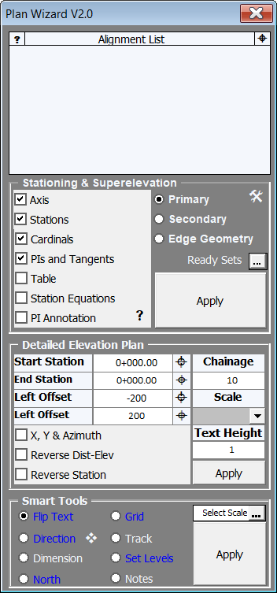

# Plan Wizard

  <iframe
    src="https://www.youtube.com/embed/H6Sz0n6x9Hw"
    frameborder="0"
    allowfullscreen
    style="position: absolute; top: 0; left: 0; width: 100%; height: 100%;"
  ></iframe>

  
  
  

## Observations

Designers perform various  tasks about  alignment manually or through various codes and attempt to process information such as radius, axis data, and other details like application tables, or kilometer-coordinate details for the route on the plan.  Most widely used softwares in this field typically have a single capability, and they do not work in conjunction with Inroads; they work based on report generation and reading, and they cannot be customized for specific projects or offer bulk solutions.

## Achievements

- The Plan Wizard assists the designer with all tasks related to alignment; it calculates curve data according to the regulations published by **AASHTO** and **KGM** for conflicting curves. The calculations for curve and widening are embedded together within the Plan Wizard. These curve widenings are calculated based on selected vehicles and are not read from tables. The calculations are carried out in Excel, and the results are transferred to the drawing from Excel. It also has a customizable tracking option, which is not available within Inroads, to simplify the work.
- Works in connection with Inroads.
- The complete intersection detail projects can be produced using the Plan Wizard; it generates all the essential elements such as application tables, PI data, elevation plans, intersection island coordinate data, plan notes, grid, sheet direction texts, and platform dimensioning.

## Key Features

- It calculates curve data according to the relevant regulations, exports them to Excel, and generates curve widening sketches. It also alerts the designer for any conflicts.
- Curve widening calculations are performed and are flexible to be customized for different road types and vehicles.
- It reads the necessary transition length and curve information for horizontal PI data from Excel and creates these details accordingly.
- It writes axis, mileage, tangents, and cardinal information for curves in the desired scale and interval with a single click in the standard format.
- Curve cardinal information has associated numbers in the application table (this feature is not available in Inroads).
- It easily differentiates the required symbology for intersection arms (including all drawn data, such as some information) with the “Secondary” option.
- It generates intersection elevation plans with simple selections.
- It prepares application and intersection island coordinate tables.
- It takes into account station equations in all drawings and reports it generates.
- It includes tools for producing the closest grid to the selected point, customizable tracking, rotating all texts based on the view direction, drawing platform measurement lines, automatically placing the directional indicator (which automatically finds North, so the user doesn't need to rotate the cell), and calculating coordinates and elevations from the entered kilometers, while generating notes in various formats for almost all plan tasks in the projects.

  <iframe
    src="https://www.youtube.com/embed/gAemGhnM_0Y"
    frameborder="0"
    allowfullscreen
    style="position: absolute; top: 0; left: 0; width: 100%; height: 100%;"
  ></iframe>

