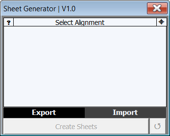
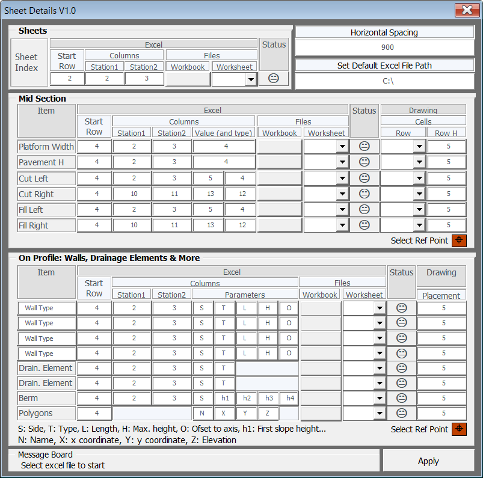

# Sheet Wizard

  
  

## Observations

- After good engineering work, if  drawings sheet have errors, it can lead to questioning the engineering services invested in the work.
- There is no widely used software that controls the sheet drawing and detailing  processes via Excel and creates presentation sheets from data. It is not possible to get a bulk result in KGM format from the Plan-Profile Generator section in Inroads either.
- Searching for drawing errors is harder than searching for errors in data. Sheet Wizard was developed with the main idea that "consistent sheets can be generated from consistent data."

## Achievements

The Sheet Wizard consists of two main components: the first is the Sheet Creator, which creates the sheet drawings via Excel and processes the details. The second component is the Sheet Details unit, which processes the linear information in the profile section of the sheet drawings and the strips related to slopes in the middle of the sheet drawing.

  

## Key Features

- When creating sheets, gridlines are automatically placed within the plan frame: Sheet Wizard performs the Helmert transformation for the project’s central meridian and also draws ED50 grids. (The purpose here is to perform a global transformation and draw ED50 grids in the absence of project-specific transformation parameters.)
- Automatically, the following are processed when creating sheets:
  - Sheet north indicator
  - Plan forward and backward directions
  - Sheet header information (project name, sheet number, etc.)
  - Sheet kilometer information
- The user addresses the sheet header information and sheet kilometer information in the sheet cell (e.g., A1) and Excel file, and the information is written to these locations. This allows for the creation of sheets in different formats beyond the standard KGM format. For example, when producing plan-profile sheets with A4 headers, header and sheet information are automatically filled in by defining the correct addresses.
- As is known, nearly all completed works in the project flow (wall, underground drainage, slope gradient, polygon, etc.) are processed into sheet drawings in KGM projects. The Sheet Details unit of the Sheet Wizard reads all these lists from Excel and writes them into the sheets. Thus, the lists, which are neatly archived during the course of the project, are automatically transferred to the drawing. No additional checks are required, and only the potential overlap of text is checked before finalizing the drawing work.

## Developer Notes

The Sheet Details component has been used in many KGM projects, while the Sheet Creator has been used in only one project so far. The development process of the Sheet Wizard as a package is ongoing.

