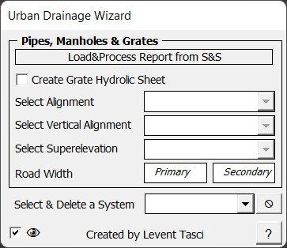

# Urban Drainage Wizard

  
  

## Observations

This software was designed in response to the need for transferring the pipe and manhole systems placed in Storm & Sanitary to a hydraulic calculation sheet in KGM format, performing the capacity calculations for these systems, and also providing the quantities and application data related to the systems.

## Achievements

The designer only performs the hydraulic calculation by reading the report from Storm & Sanitary into the wizard. The quantity and application data related to the systems are automatically prepared by the wizard in output format. Since quick results are obtained, it simplifies the design of pipe and manhole systems, which is an iterative process.

## Key Features

- Works with the route reports entered into Excel, reading the slope and longitudinal gradient at the locations of the manholes or grates from these reports.
- The quantity details are quite detailed: each manhole is placed with its depth and size, additional concrete collars around the pipes in transverse transitions, and all specifications in the underground drainage are included according to the standards. The user only needs to perform the hydraulic calculation.
- The assumptions are clear (such as drainage excavation slopes, etc.).
- Detailed specifications for manholes suitable for KGM are included, and if needed, they can be modified for new types of manholes.
- With its grouping formulas, the total quantity can be tracked at every step, and errors can be detected easili if they exists.
- Manhole coordinates and pipe connection reports for the site are automatically generated.

